# GrindPulse - Issue Prioritization Plan

**Framework**: RICE (Reach × Impact × Confidence ÷ Effort)
**Date**: 2026-01-08 (Updated: 2026-01-08)
**Total Issues**: 18 open issues
**Total Effort**: 26.75 days

---

## Freshness Status (2026-03-27)

*Checked by issue-scrutinizer against codebase and open PRs on 2026-03-27.*

| Issue | Status | Confidence | Notes |
|-------|--------|------------|-------|
| **#42** | PR in progress (PR #47) | 0.95 | Link extraction not yet merged to main. CI passing. |
| **#38** | PR in progress (PR #45) | 0.95 | Awareness optimization not yet merged. CI passing. |
| **#36** | PR in progress (PR #39) | 0.95 | Config load optimization not yet merged. CI passing. |
| **#28** | Valid | 0.90 | Mixed bracket syntax confirmed in release.yml (line 51 vs rest). No PR. |
| **#26** | Valid | 0.92 | No timeout-minutes in release.yml. Steps can hang 6h. |
| **#44** | Valid | 0.90 | Random picker not implemented in js_core_generator.py. |
| **#13** | Valid | 0.90 | localStorage failures silently swallowed (lines 130-143). |
| **#41** | Valid | 0.90 | No column sort with toggle or localStorage persistence. |
| **#46** | Valid (blocked) | 0.85 | Depends on #38 (PR in progress). Do not start yet. |
| **#37** | Valid | 0.90 | Hamburger visibility bug confirmed in css_generator.py. |
| **#14** | Valid (blocked) | 0.85 | Depends on #36 (PR in progress). Do not start yet. |
| **#43** | Valid | 0.80 | roadmap.mmd exists. Feature not started. High complexity risk (4d). |
| **#23** | Valid | 0.90 | FileIOError not renamed. file_path optional in subclasses. All 5 issues remain. |
| **#22** | Partial | 0.85 | PermissionError tests only for write_output; 4 of 5 scenarios missing. |
| **#25** | Valid | 0.80 | Only tag-failure cleanup; no general state tracking. Overengineering risk. |
| **#27** | Partial | 0.80 | No dry-run-specific GITHUB_STEP_SUMMARY step exists. Mostly valid. |
| **#29** | Partial | 0.70 | git ls-remote exit codes already in release.yml line 339 comments. Artifact retention and cleanup conditionality still need documenting in CLAUDE.md. |
| **#40** | Valid (blocked) | 0.90 | No tooltip logic. Depends on #38 (PR in progress). |

### Key Findings

- **3 PRs in flight**: #42 (PR #47), #38 (PR #45), #36 (PR #39) - all CI green, awaiting review/merge
- **3 issues blocked on those PRs**: #46 (needs #38), #14 (needs #36), #40 (needs #38)
- **#29 has reduced scope**: git ls-remote exit codes already documented inline; only artifact retention + cleanup conditionality remain for CLAUDE.md
- **#22 is partially addressed**: write_output PermissionError tested; 4/5 requested scenarios still missing
- **All other 14 issues are fully valid** - no false positives in backlog

---

## Executive Summary

### Priority Overview

| Priority | Issues | Total Effort | Focus |
|----------|--------|--------------|-------|
| **P0** | 3 | 3.5 days | Critical workflow improvements |
| **P1** | 6 | 9.25 days | Quick wins + UX + sorting + random picker + urgent review filter |
| **P2** | 6 | 12.5 days | Error handling + testing + UI bugs + progressive filtering |
| **P3** | 3 | 1.5 days | Code quality + docs + tooltips |

### Top 3 Recommendations

1. **#42 - Clickable problem name links** (RICE: 360.0) - P0 Critical 🔥🔥
   - **Highest RICE score in entire backlog**
   - Core workflow improvement - reduces friction for 90% of users
   - Only 0.5 days effort - massive value for minimal cost
   - **Start immediately**

2. **#38 - Optimize awareness color updates** (RICE: 300.0) - P0 Critical 🔥
   - UI slowdowns interfere with filtering workflow
   - Start after #42

3. **#36 - Optimize config downloads** (RICE: 105.0) - P0 Critical
   - Downloads on every sync interfere with usage
   - Start after #38

---

## RICE Prioritization Matrix

| Rank | Issue | Title | RICE | Reach | Impact | Conf | Effort | Priority |
|------|-------|-------|------|-------|--------|------|--------|----------|
| 1 | **#42** | Clickable problem links | **360.0** | 90% | 2.0 | 1.0 | 0.5d | P0 🔥🔥 |
| 2 | **#38** | Awareness color updates | **300.0** | 100% | 3.0 | 1.0 | 1d | P0 🔥 |
| 3 | **#36** | Config optimization | **105.0** | 70% | 3.0 | 1.0 | 2d | P0 🔴 |
| 4 | **#28** | Shell syntax | **80.0** | 40% | 0.5 | 1.0 | 0.25d | P1 ⭐ |
| 5 | **#26** | Step timeouts | **80.0** | 40% | 1.0 | 1.0 | 0.5d | P1 ⭐ |
| 6 | **#44** | Random problem picker | **70.0** | 70% | 1.0 | 1.0 | 1d | P1 🟡 |
| 7 | **#13** | localStorage notifications | **66.7** | 100% | 1.0 | 1.0 | 1.5d | P1 🟡 |
| 8 | **#41** | Sortable problem columns | **63.0** | 70% | 2.0 | 0.9 | 2d | P1 🟡 |
| 9 | **#46** | Most Urgent Review filter | **56.0** | 70% | 2.0 | 0.8 | 2d | P1 🟡 |
| 10 | **#37** | Burger menu visibility | **40.0** | 40% | 0.5 | 1.0 | 0.5d | P2 |
| 11 | **#29** | Documentation | **26.7** | 40% | 0.5 | 1.0 | 0.75d | P3 |
| 12 | **#40** | Awareness tooltips | **26.7** | 40% | 0.5 | 1.0 | 0.75d | P3 |
| 13 | **#22** | Test coverage | **21.3** | 40% | 1.0 | 0.8 | 1.5d | P2 |
| 14 | **#14** | Firebase errors | **18.7** | 70% | 1.0 | 0.8 | 3d | P1 🟡 |
| 15 | **#43** | Progressive pattern filtering | **17.5** | 40% | 2.5 | 0.7 | 4d | P2 |
| 16 | **#27** | Dry run summary | **13.3** | 40% | 0.5 | 1.0 | 1.5d | P3 |
| 17 | **#25** | Rollback/state | **12.8** | 40% | 1.0 | 0.8 | 2.5d | P2 |
| 18 | **#23** | Exception quality | **10.7** | 40% | 0.5 | 0.8 | 1.5d | P2 |

**Legend**: 🔥🔥 Urgent Critical (Highest Priority) | 🔥 Urgent Critical | 🔴 Critical | 🟡 High Priority | ⭐ Quick Win

---

## Dependency Graph

```mermaid
graph TD
    subgraph Sprint1[Sprint 1: Critical Workflow + Performance - 10.75 days]
        I42[#42 Clickable problem links<br/>RICE: 360.0 - 0.5d]
        I38[#38 Awareness color updates<br/>RICE: 300.0 - 1d]
        I36[#36 Config optimization<br/>RICE: 105.0 - 2d]
        I28[#28 Shell syntax<br/>RICE: 80.0 - 0.25d]
        I26[#26 Step timeouts<br/>RICE: 80.0 - 0.5d]
        I44[#44 Random problem picker<br/>RICE: 70.0 - 1d]
        I13[#13 localStorage notifications<br/>RICE: 66.7 - 1.5d]
        I41[#41 Sortable columns<br/>RICE: 63.0 - 2d]
        I46[#46 Most Urgent Review filter<br/>RICE: 56.0 - 2d]
    end

    subgraph Sprint2[Sprint 2: Error Handling + Testing + UX - 12.5d]
        I78[#78 Urgent filter tiered selection<br/>P1 bug - 2d]
        I14[#14 Firebase errors<br/>RICE: 18.7 - 3d]
        I43[#43 Progressive pattern filtering<br/>RICE: 17.5 - 4d]
        I37[#37 Burger menu visibility<br/>RICE: 40.0 - 0.5d]
        I23[#23 Exception quality<br/>RICE: 10.7 - 1.5d]
        I22[#22 Test coverage<br/>RICE: 21.3 - 1.5d]
    end

    subgraph Sprint3[Sprint 3: Release Workflow + Enhancements - 5.5d]
        I25[#25 Rollback/state<br/>RICE: 12.8 - 2.5d]
        I27[#27 Dry run summary<br/>RICE: 13.3 - 1.5d]
        I29[#29 Documentation<br/>RICE: 26.7 - 0.75d]
        I40[#40 Awareness tooltips<br/>RICE: 26.7 - 0.75d]
    end

    I42 --> I38
    I38 --> I36
    I36 --> I14
    I38 --> I40
    I38 --> I46
    I46 --> I78
    I26 --> I25
    I26 --> I27
    I23 --> I22

    I25 --> I29
    I27 --> I29

    style I42 fill:#FF0000,stroke:#333,stroke-width:5px
    style I38 fill:#FF0000,stroke:#333,stroke-width:4px
    style I36 fill:#FF6B6B,stroke:#333,stroke-width:3px
    style I28 fill:#90EE90,stroke:#333
    style I26 fill:#90EE90,stroke:#333
    style I13 fill:#FFB84D,stroke:#333
    style I41 fill:#FFB84D,stroke:#333
```



---

## Recommended Work Order

### Sprint 1: Critical Workflow + Performance (10.75 days)

**Goal**: Address P0 workflow improvements first, then performance blockers, add major usability features

1. **#42 - Clickable problem name links** (0.5 days) 🔥🔥
   - **RICE**: 360.0 | **Priority**: P0 Urgent Critical - **HIGHEST PRIORITY IN BACKLOG**
   - **Why**: Core workflow improvement - 90% reach, massive value for minimal effort
   - **Files**: `data_parser.py`, `js_core_generator.py`, `css_generator.py`
   - **Action**: Extract Link field from TSV, render as anchor tags with external link icon
   - **Dependency**: Must complete first - enables #38 (improves workflow before optimizing performance)

2. **#38 - Optimize awareness color updates** (1 day) 🔥
   - **RICE**: 300.0 | **Priority**: P0 Urgent Critical
   - **Why**: UI slowdowns interfere with filtering
   - **Files**: `js_awareness_generator.py`, `js_core_generator.py`
   - **Action**: Update colors only on load, refresh, config changes, and problem updates (not during filtering)
   - **Dependency**: Must complete before #40 (tooltips depend on stable color system)

3. **#36 - Optimize config downloads** (2 days)
   - **RICE**: 105.0 | **Priority**: P0 Critical
   - **Why**: Interferes with normal usage flow (downloads on every sync)
   - **Files**: `js_firebase_generator.py`, `js_config_sync_generator.py`
   - **Action**: Add `configsLoadedFromCloud` flag, load once at sign-in only

4. **#28 - Shell syntax standardization** (0.25 days) ⭐
   - **RICE**: 80.0 | **Priority**: P1 Quick Win
   - **Why**: Minimal effort, clean tech debt
   - **Files**: `.github/workflows/release.yml`
   - **Action**: Standardize to `[[ ]]` bash syntax

5. **#26 - Add step timeouts** (0.5 days) ⭐
   - **RICE**: 80.0 | **Priority**: P1 Quick Win
   - **Why**: Prevents 6-hour wasted compute, enables #25/#27
   - **Files**: `.github/workflows/release.yml`
   - **Action**: Add `timeout-minutes` to all steps (Build 10m, Test 10m, etc.)

6. **#44 - Random problem picker** (1 day)
   - **RICE**: 70.0 | **Priority**: P1 High Impact
   - **Why**: Reduces decision fatigue for 70% of users
   - **Files**: `html_generator.py`, `js_core_generator.py`, `css_generator.py`
   - **Action**: Add random button in filter section, select from visible problems, scroll + highlight animation

7. **#13 - localStorage failure notifications** (1.5 days)
   - **RICE**: 66.7 | **Priority**: P1 High Impact
   - **Why**: 100% user reach, prevents silent data loss
   - **Files**: `js_core_generator.py`, `css_generator.py`
   - **Action**: Detect localStorage availability, show non-intrusive notification on failure

8. **#41 - Sortable problem columns** (2 days)
   - **RICE**: 63.0 | **Priority**: P1 High Impact
   - **Why**: Major usability improvement for 70% of users
   - **Files**: `js_core_generator.py`, `html_generator.py`, `css_generator.py`
   - **Action**: Add 10 sort criteria with ascending/descending toggle, localStorage persistence

9. **#46 - Most Urgent Review filter** (2 days)
   - **RICE**: 56.0 | **Priority**: P1 High Impact
   - **Why**: Enhances spaced repetition workflow for 70% of users, enables proactive review
   - **Files**: `js_core_generator.py`, `js_awareness_generator.py`, `html_generator.py`, `css_generator.py`
   - **Action**: Calculate days-until-Flashing, filter to most urgent solved problems, handle ties
   - **Dependency**: Requires stable awareness system from #38

**Sprint 1 Deliverables**:

- **Core workflow dramatically improved** (#42 - clickable links)
- All 3 P0 blockers resolved (#42, #38, #36)
- 2 quick wins shipped (0.75 days total)
- Major usability enhancements (sorting + localStorage notifications + random picker + urgent review)
- Spaced repetition workflow enhanced (#46 - Most Urgent Review filter)
- User experience transformed for 90%+ of users

---

### Sprint 2: Error Handling + Testing + Advanced UX (12.5 days)

**Goal**: Fix urgent filter accuracy, improve Firebase reliability, fix UI bugs, add progressive learning system, establish testing foundation

1. **#78 - Urgent review filter tiered selection** (2 days)
    - **RICE**: TBD | **Priority**: P1 (bug)
    - **Why**: Urgent filter skips yellow tier — shows red+green only. User-reported bug.
    - **Files**: `js_core_generator.py`, `js_awareness_generator.py`
    - **Action**: Replace OR-based filter with tiered waterfall: Flashing(all) → DarkRed(7) → Red(5) → Yellow(3) → Green(1), sorted by days to next tier, excluding problems solved ≤7 days ago
    - **Dependency**: Follows Sprint 1 #46 (same filter area)

2. **#37 - Burger menu visibility fix** (0.5 days)

- **RICE**: 40.0 | **Priority**: P2
- **Why**: Users cannot access export/import with small filtered lists
- **Files**: `css_generator.py`
- **Action**: Fix CSS layout so menus stay visible regardless of problem count

1. **#14 - Firebase error handling** (3 days)
    - **RICE**: 18.7 | **Priority**: P1
    - **Why**: Better error recovery for 70% of users
    - **Files**: `js_firebase_generator.py`
    - **Action**: Handle specific error codes (permission-denied, unavailable, etc.), add retry logic
    - **Dependency**: Must follow #36 (same file conflict)

2. **#43 - Progressive pattern filtering** (4 days)
    - **RICE**: 17.5 | **Priority**: P2
    - **Why**: Transforms learning experience for beginners with structured progression
    - **Files**: `roadmap_parser.py` (new), `build_tracker.py`, `html_generator.py`, `js_core_generator.py`, `css_generator.py`
    - **Action**: Parse roadmap graph, track pattern completion, unlock dependent patterns, add visual sidebar
    - **Dependency**: Complex feature - implement after core Sprint 2 work

3. **#23 - Exception code quality** (1.5 days)
    - **RICE**: 10.7 | **Priority**: P2
    - **Why**: Clean foundation before testing
    - **Files**: `exceptions.py`, `build_tracker.py`, `data_parser.py`
    - **Action**: Fix 5 quality issues (rename FileIOError, make file_path required, etc.)

4. **#22 - Test coverage for permission errors** (1.5 days)
    - **RICE**: 21.3 | **Priority**: P2
    - **Why**: Close test coverage gaps
    - **Files**: `tests/python/test_*.py`
    - **Action**: Add 5 test scenarios (load_parsed_data, load_firebase_config, etc.)
    - **Dependency**: Follows #23 for cleaner code structure

**Sprint 2 Deliverables**:

- Urgent review filter fixed with tiered waterfall selection (#78)
- UI bugs fixed (burger menus)
- Firebase reliability improved
- Progressive learning system implemented (major UX enhancement)
- Exception handling module cleaned
- 90%+ test coverage maintained

---

### Sprint 3: Release Workflow + Enhancements + Docs (5.5 days)

**Goal**: Complete release workflow improvements, add user-facing enhancements, document changes

1. **#25 - Rollback/state tracking** (2.5 days)
    - **RICE**: 12.8 | **Priority**: P2
    - **Why**: Recovery from partial failures
    - **Files**: `.github/workflows/release.yml`
    - **Action**: Track created resources, add cleanup on failure, make steps idempotent
    - **Dependency**: Requires #26 (timeout foundation)

2. **#27 - Dry run summary** (1.5 days)
    - **RICE**: 13.3 | **Priority**: P3
    - **Why**: Developer convenience
    - **Files**: `.github/workflows/release.yml`
    - **Action**: Add GITHUB_STEP_SUMMARY with preview (tag, branch, PR, release, artifact size)
    - **Dependency**: Enhanced by #26 context

3. **#29 - Documentation improvements** (0.75 days)
    - **RICE**: 26.7 | **Priority**: P3
    - **Why**: Document release workflow changes
    - **Files**: `CLAUDE.md` (main/)
    - **Action**: Document artifact retention, cleanup conditions, git ls-remote exit codes
    - **Dependency**: Documents #26, #25, #27

4. **#40 - Awareness tooltips** (0.75 days)
    - **RICE**: 26.7 | **Priority**: P3
    - **Why**: Help users understand awareness colors and point values
    - **Files**: `js_awareness_generator.py`, `css_generator.py`
    - **Action**: Add tooltip on hover showing awareness points; long-press for mobile
    - **Dependency**: Requires stable color system from #38

**Sprint 3 Deliverables**:

- Release workflow fully hardened
- User-facing awareness tooltip feature
- Comprehensive documentation updated
- Developer and user experience improved

---

## Key Insights

### Quick Wins (High RICE, ≤1 day)

- **#42** - Clickable problem links (RICE: 360.0, 0.5d) - **HIGHEST PRIORITY - massive value for minimal effort**
- **#38** - Awareness color optimization (RICE: 300.0, 1d) - Dramatic performance impact
- **#28** - Shell syntax (RICE: 80.0, 0.25d) - Best effort-to-value ratio for infra
- **#26** - Step timeouts (RICE: 80.0, 0.5d) - Enables other improvements

### High-Impact Priorities

- **#42** - Clickable problem links (RICE: 360.0) - P0 Urgent, 90% reach, core workflow
- **#38** - Awareness color updates (RICE: 300.0) - P0 Urgent, UI slowdowns during filtering
- **#36** - Config optimization (RICE: 105.0) - P0, interferes with usage
- **#13** - localStorage notifications (RICE: 66.7) - 100% user reach
- **#41** - Sortable columns (RICE: 63.0) - Major usability improvement, 70% user reach
- **#14** - Firebase error handling (RICE: 18.7) - Lower RICE due to 3d effort, but high user value

### File Conflict Zones

| File | Issues | Strategy |
|------|--------|----------|
| `js_core_generator.py` | #42, #38, #13, #41, #44, #46, #78 | Sequence: #42 → #38 → #44/#13/#41/#46 → #78 (links first, then colors, then features, then filter fix) |
| `js_awareness_generator.py` | #38, #40, #46, #78 | Sequence: #38 → #46/#40 → #78 (stable colors before dependent features) |
| `js_firebase_generator.py` | #36, #14 | Sequence: #36 → #14 |
| `.github/workflows/release.yml` | #26, #28, #25, #27 | Sequence: #26/#28 → #25/#27 |
| `exceptions.py` / tests | #23, #22 | Sequence: #23 → #22 |

### Parallelization Opportunities

- Sprint 1: Start with #42; after #42, run #38 and #36 in parallel; after #38, #46 can start; after both #38 and #36, run #44/#13/#41, #28, #26 in parallel
- Sprint 2: #78 first (urgent filter fix); #37 can run parallel with #23; #14 must follow #36
- Sprint 3: #25 and #27 can run parallel after #26; #40 can run parallel with #46 after #38

---

## Risk Mitigation

1. **#42 (P0 Urgent)**: Start immediately - highest RICE score (360.0), massive value for minimal effort
2. **#38 (P0 Urgent)**: Start after #42 - blocks normal filtering workflow
3. **#36 (P0)**: Can run parallel with #38 - blocks normal sync usage
4. **#14 (3 days)**: Risk of scope creep on retry logic - keep focused
5. **#25 (2.5 days)**: Edge case handling - may be overengineered, watch scope
6. **File conflicts**:
   - #42, #38, #13, #41, #44, #46 all touch `js_core_generator.py` - coordinate timing
   - #38, #40, #46 all touch `js_awareness_generator.py` - coordinate timing
   - #36 and #14 both touch `js_firebase_generator.py` - coordinate timing

---

## Effort Summary

| Sprint | Issues | Days | Focus |
|--------|--------|------|-------|
| **Sprint 1** | 9 | 10.75 | Critical Workflow + Performance + UX |
| **Sprint 2** | 5 | 10.5 | Error Handling + Testing + Advanced UX |
| **Sprint 3** | 4 | 5.5 | Release Workflow + Enhancements + Docs |
| **TOTAL** | 18 | **26.75 days** | Full backlog |

**Timeline Estimates**:

- **Optimistic (3 developers)**: ~5 weeks calendar time
- **Conservative (1 developer)**: ~6 weeks calendar time

---

## Next Actions

1. **Label unlabeled issues** (15 min)
   - ✅ #37 already labeled (P2, Sprint2, bug)
   - ✅ #38 already labeled (P0, Sprint1, enhancement)
   - ✅ #40 already labeled (P3, Sprint3, enhancement)
   - ✅ #41 already labeled (P1, Sprint1, enhancement)
   - ✅ #42 already labeled (P0, Sprint1, enhancement, good first issue)
   - ✅ #43 already labeled (P2, Sprint2, enhancement)
   - ✅ #44 already labeled (P1, Sprint1, enhancement, good first issue)
   - ✅ #46 already labeled (P1, Sprint1, enhancement)
   - Add priority labels: P2 to #26, #25, #22, #23
   - Add type labels: "enhancement" to #25-27, "testing" to #22, "chore" to #28

2. **Assign #42 immediately** (P0 Urgent) 🔥🔥
   - **HIGHEST PRIORITY ISSUE IN ENTIRE BACKLOG** (RICE: 360.0)
   - Core workflow improvement with 90% reach
   - Only 0.5 days - massive ROI
   - **Start immediately**

3. **Schedule Sprint 1** (Week of Jan 13)
   - Start with #42 (P0 Urgent - clickable problem links) - **HIGHEST PRIORITY**
   - Follow with #38 (P0 Urgent - awareness color optimization)
   - Then #36 (P0 - config optimization)
   - Knock out #28 and #26 (quick wins)
   - Implement #44 (random problem picker), #13 (localStorage notifications), #41 (sortable columns), and #46 (urgent review filter)

---

## Verification

After implementing this plan:

1. **Sprint 1 verification**:
   - Test problem name links are clickable with external link icon (↗)
   - Verify links open in new tab with proper security attributes
   - Test fallback for problems without links (display as plain text)
   - Test awareness color updates only trigger on load/refresh/config change/problem update (not filtering)
   - Measure filter operation performance (should be instant)
   - Run `python build_tracker.py` and verify config loads once at sign-in
   - Test localStorage notification appears in private browsing mode
   - Test all 10 sort criteria work with ascending/descending toggle
   - Verify sort state persists in localStorage per tab
   - Test sorting works correctly with active filters
   - Test random problem picker button with various filter combinations
   - Verify random selection scrolls to and highlights the selected problem row
   - Test random picker works across all tabs
   - Test disabled state when no problems match filters
   - Test Most Urgent Review filter with various solved problem states
   - Verify urgency calculations match awareness point decay algorithm
   - Test tie-breaking shows all tied problems (not just one)
   - Verify filter disabled when no solved problems exist
   - Test filter shows correct urgency messages ("Flashing NOW" vs "Flashing in X days")
   - Verify workflow timeouts work with test run
   - Check shell syntax consistency with shellcheck

2. **Sprint 2 verification**:
   - Test burger menus visible with 0-1 filtered problems
   - Trigger Firebase errors (go offline) and verify specific error messages
   - Run test suite: `cd tests && npm test` - verify 90%+ coverage
   - Check exception quality improvements with linter

3. **Sprint 3 verification**:
   - Test workflow dry run mode shows summary
   - Trigger workflow failure and verify cleanup
   - Hover over problems and verify awareness tooltip appears with point values
   - Test long-press tooltip on mobile devices
   - Review updated documentation completeness

---

## Assumptions

1. **Reach estimates**:
   - 70% Firebase adoption (users with sync enabled)
   - 40% developer-facing issues (typical contributor ratio)
   - 100% localStorage usage (offline-first architecture)

2. **Impact scoring**:
   - Performance blockers = Massive (3.0)
   - Data loss prevention = Medium (1.0)
   - Code quality/docs = Low (0.5)

3. **Effort estimates**: Provided day estimates as full-time equivalent

---

## Suggested Label Updates

Run these commands to update issue labels:

```bash
# Add type labels
gh issue edit 26 --add-label "enhancement"
gh issue edit 25 --add-label "enhancement"
gh issue edit 27 --add-label "enhancement"
gh issue edit 22 --add-label "testing"
gh issue edit 28 --add-label "chore"

# Issues #37, #38, #40, #41, #42, #43, #44, #46 already have correct labels
```

---

**Status**: Updated 2026-01-08 - Ready for execution
**Recommendation**: Start Sprint 1 immediately with #42 (P0 Urgent Critical - highest RICE score: 360.0 🔥🔥)
